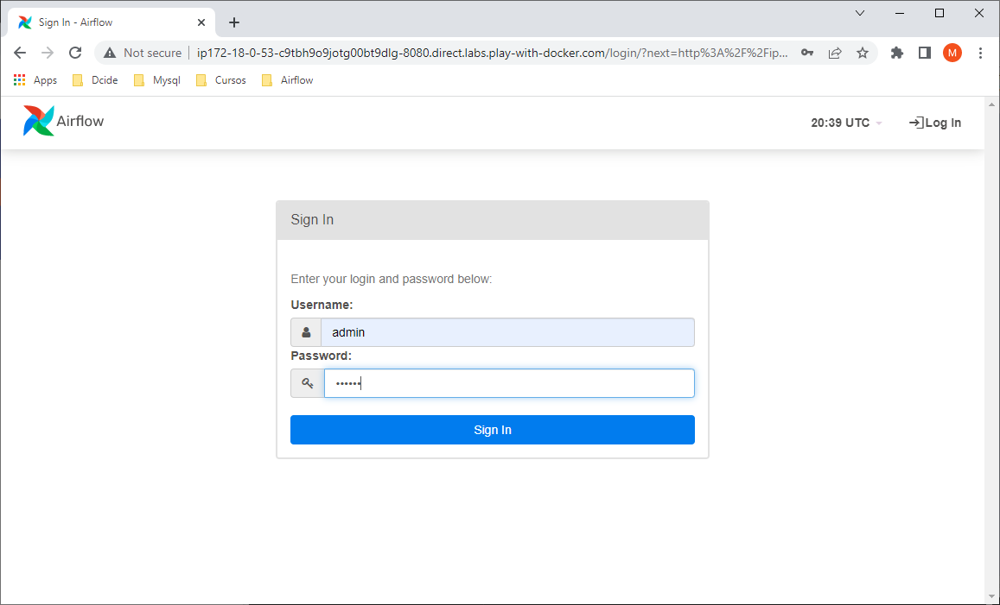
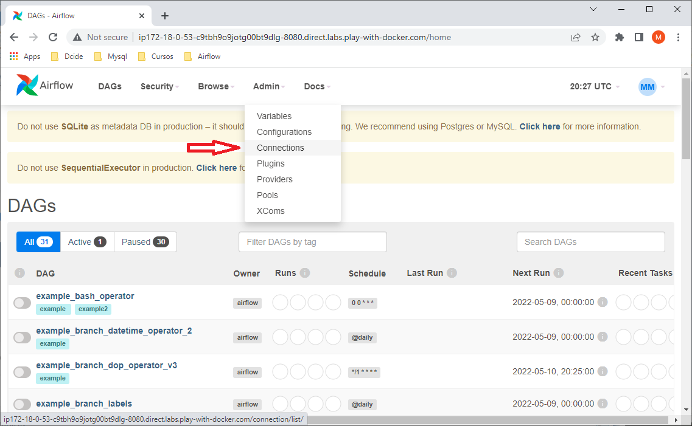
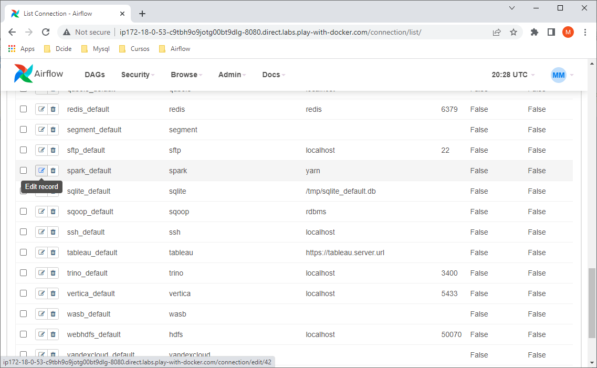
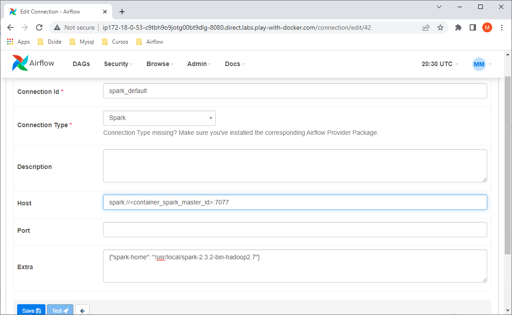
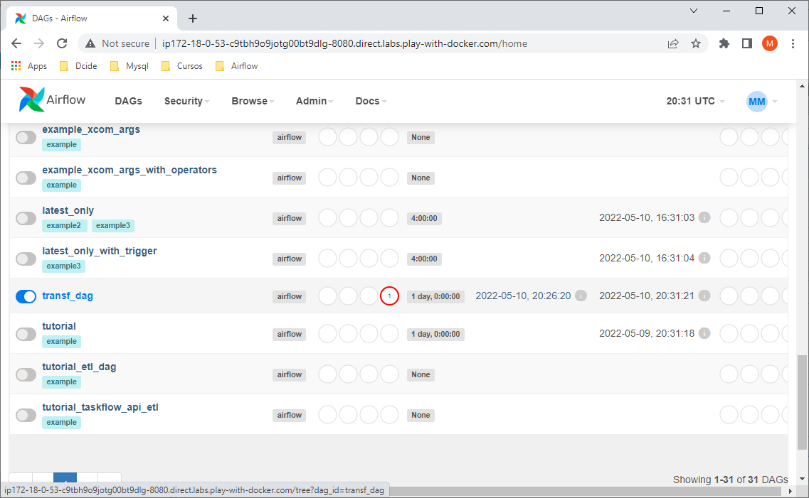
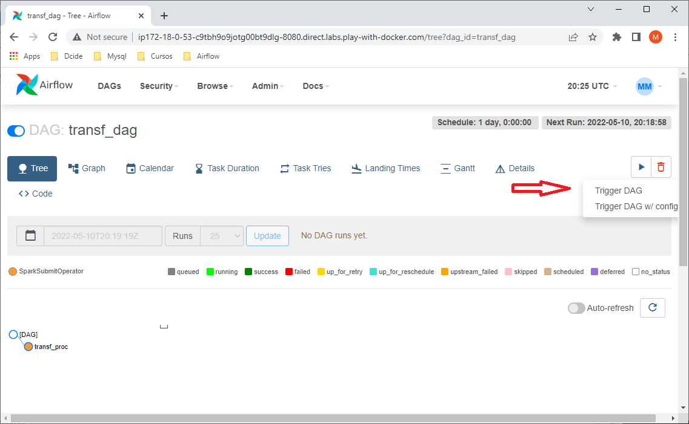
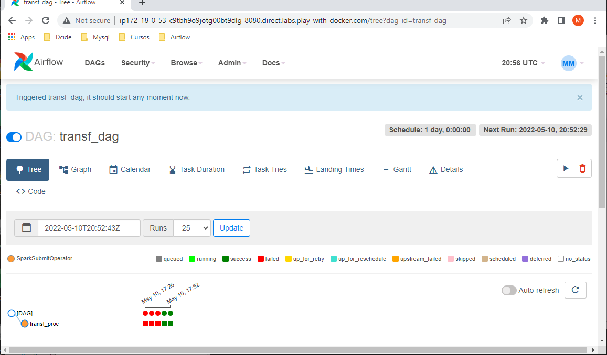
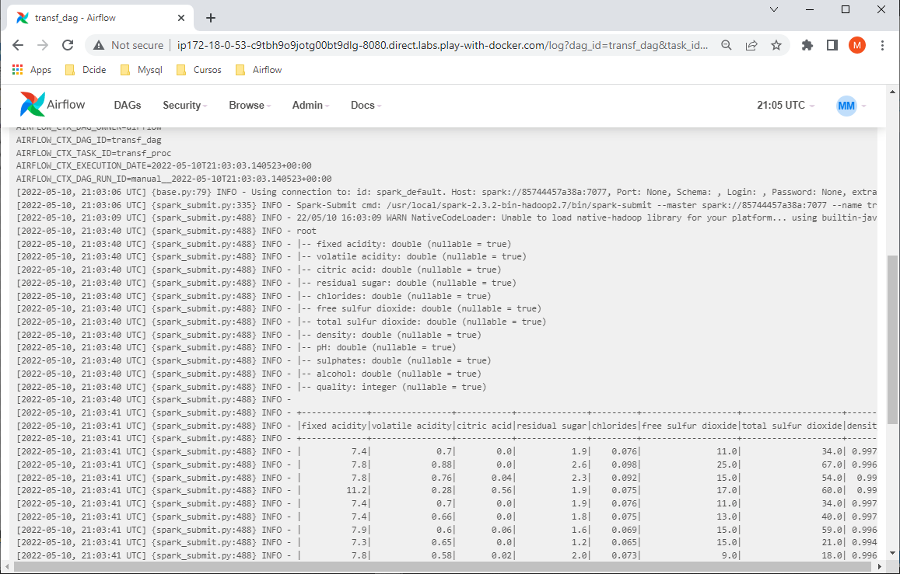

# Airflow running into Spark Standalone cluster in Docker

Apache Airflow is an open-source, workflow management processing system used to coordinate big data workloads.

In this demo, a Airflow container uses a Spark Standalone cluster as a resource management and job scheduling technology to perform distributed data processing.

This Docker image contains Airflow and Spark binaries prebuilt and uploaded in Docker Hub.

## Steps to Build Airflow image
```shell
$ git clone https://github.com/mkenjis/apache_binaries
$ wget https://archive.apache.org/dist/spark/spark-2.3.2/spark-2.3.2-bin-hadoop2.7.tgz
$ docker image build -t mkenjis/airflow_xtd_spark_img
$ docker login
Login with your Docker ID to push and pull images from Docker Hub. If you don't have a Docker ID, head over to https://hub.docker.com to create one.
Username: mkenjis
Password: 
WARNING! Your password will be stored unencrypted in /root/.docker/config.json.
Configure a credential helper to remove this warning. See
https://docs.docker.com/engine/reference/commandline/login/#credentials-store

Login Succeeded
$ docker image push mkenjis/airflow_xtd_spark_img
```

## Shell Scripts Inside 

> run_airflow.sh

Sets up the environment for Spark client by executing the following steps :
- starts the Webserver service for UI Airflow 
- starts the Scheduler service


## Initial Steps on Docker Swarm

To start with, start Swarm mode in Docker in node1
```shell
$ docker swarm init
Swarm initialized: current node (xv7mhbt8ncn6i9iwhy8ysemik) is now a manager.

To add a worker to this swarm, run the following command:

    docker swarm join --token <token> <IP node1>:2377

To add a manager to this swarm, run 'docker swarm join-token manager' and follow the instructions.
```

Add more workers in cluster hosts (node2, node3, ...) by joining them to manager.
```shell
$ docker swarm join --token <token> <IP node1>:2377
```

Change the workers as managers in node2, node3, ...
```shell
$ docker node promote node2
$ docker node promote node3
$ docker node promote ...
```

Start Docker stack using docker-compose.yml
```shell
$ docker stack deploy -c docker-compose.yml airf
```

Check the status of each service started
```shell
$ docker service ls
ID             NAME            MODE         REPLICAS   IMAGE                                  PORTS
lkm9m7w4tcwg   airf_airflow    replicated   1/1        mkenjis/airflow_xtd_spark_img:latest   *:8080->8080/tcp
o7ggcjcrrdd2   airf_hadoop     replicated   1/1        mkenjis/ubhdp_img:latest               
s0lr2m27ptk3   airf_spk_mst    replicated   1/1        mkenjis/ubspkcluster_img:latest        
251p744izqr0   airf_spk_wkr1   replicated   1/1        mkenjis/ubspkcluster_img:latest        
c62nf5kf2l6z   airf_spk_wkr2   replicated   1/1        mkenjis/ubspkcluster_img:latest        
xbins34s94l1   airf_spk_wkr3   replicated   1/1        mkenjis/ubspkcluster_img:latest
```

## Load dataset into Hadoop Docker container

Identify which Docker container started as Hadoop and logged into it
```shell
$ docker service ps airf_hadoop
ID             NAME            IMAGE                      NODE      DESIRED STATE   CURRENT STATE           ERROR     PORTS
efxw2rbw83yp   airf_hadoop.1   mkenjis/ubhdp_img:latest   node3     Running         Running 4 minutes ago 

$ docker container ls   # run it in the node listed above and check which <container ID> is running the Hadoop master constainer
CONTAINER ID   IMAGE                      COMMAND                  CREATED         STATUS         PORTS      NAMES
a62b5898628c   mkenjis/ubhdp_img:latest   "/usr/bin/supervisord"   5 minutes ago   Up 5 minutes   9000/tcp   airf_hadoop.1.efxw2rbw83ypoz0bqizd7nczx
```

Load the dataset into Hadoop´s container HDFS filesystem

```shell
$ docker container cp wine_quality.csv <container ID>:/tmp

$ docker container exec -it <container ID> bash

$ hdfs dfs -mkdir /data 
$ hdfs dfs -put /tmp/wine_quality.csv /data
$ hdfs dfs -ls /data
Found 1 items
-rw-r--r--   1 root supergroup      84199 2022-05-10 14:55 /data/wine_quality.csv
```

## Loading Python scripts in Airflow Docker container

Identify which Docker container started as Airflow and logged into it
```shell
$ docker service ps airf_airflow
ID             NAME             IMAGE                                  NODE      DESIRED STATE   CURRENT STATE            ERROR     PORTS
qmhzon64szjb   airf_airflow.1   mkenjis/airflow_xtd_spark_img:latest   node1     Running         Running 11 minutes ago

$ docker container ls   # run it in the node listed above and check which <container ID> is running the Hadoop master constainer
CONTAINER ID   IMAGE                                  COMMAND                  CREATED          STATUS          PORTS                                          NAMES
af30de6ade07   mkenjis/airflow_xtd_spark_img:latest   "/usr/bin/supervisord"   13 minutes ago   Up 13 minutes   8080/tcp                                       airf_airflow.1.qmhzon64szjb0fnrlucnxe1mn
3b591e008a92   mkenjis/ubspkcluster_img:latest        "/usr/bin/supervisord"   15 minutes ago   Up 15 minutes   4040/tcp, 7077/tcp, 8080-8082/tcp, 10000/tcp   airf_spk_wkr1.1.ir53adba58f2x6l2hdl2eckw7
```

Inside the Airflow container, load Python scripts as below
```shell
$ docker container cp transform.py <container ID>:/root
$ docker container cp transf_dag.py <container ID>:/root/airflow/dags/transf_dag.py
$ docker container exec -it <container ID> bash

$ vi transform.py  -- change HDFS path pointing to container running Hadoop container (in the script hdfs://<container_id>:9000)
```

Add the following parameters to $SPARK_HOME/conf/spark-defaults.conf
```shell
$ vi $SPARK_HOME/conf/spark-env.sh
export JAVA_HOME=/usr/local/jre1.8.0_181
```

## Execute the following steps in Airflow UI
















